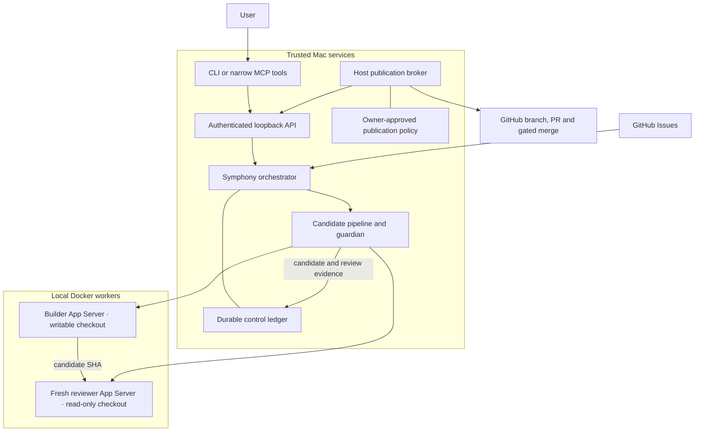

# Architecture

Symphony schedules coding work from GitHub Issues on one trusted Mac. The controlled
profile adds durable execution limits, operator commands, a separate reviewer and a
host publication broker. Coding workers run in local Docker containers; application
services and cloud infrastructure remain separate from this orchestration runtime.
The control services are usable while paused; live coding is disabled pending the
runtime acceptance checks described below.

## System boundary

The scheduler owns admission and execution. The builder commits locally and the
reviewer examines that exact SHA in a separate checkout. The host broker validates
the retained handoff before publishing a branch and draft PR. An explicitly enabled
documentation-only merge policy adds independent path, review, branch-protection and
CI gates. Deployment still requires the user's authorization. MCP forwards bounded
commands to the native API and owns no scheduling state.

## Code map

- [`profiles/events-concierge/profile.py`](profiles/events-concierge/profile.py)
  owns project configuration and the local launch environment. Project workflow
  policy is versioned alongside the profile; credentials and runtime files are
  not source documentation.
- [`Tracker`](elixir/lib/symphony_elixir/tracker.ex) selects the provider adapter.
  [`GitHub.Admission`](elixir/lib/symphony_elixir/github/admission.ex) requires an
  explicit dependency declaration and verifies referenced issues directly.
- [`Orchestrator`](elixir/lib/symphony_elixir/orchestrator.ex) is the single
  scheduling authority. It polls, reconciles eligibility, reserves attempts,
  starts supervised workers and handles completion, deadlines and retries.
- [`ControlLedger`](elixir/lib/symphony_elixir/control_ledger.ex) retains operating
  mode, issue holds, attempts, runtime/token totals and candidate handoffs.
  The orchestrator owns writes; an OS advisory lock rejects a second owner.
- [`AgentRunner`](elixir/lib/symphony_elixir/agent_runner.ex) selects controlled or
  upstream execution. [`CandidatePipeline`](elixir/lib/symphony_elixir/candidate_pipeline.ex)
  performs the bounded builder/reviewer sequence and validates its results.
- [`Codex.AppServer`](elixir/lib/symphony_elixir/codex/app_server.ex) implements
  the Codex stdio protocol and verifies the named permission profile before each
  controlled thread can run. [`ProcessGroup`](elixir/lib/symphony_elixir/process_group.ex)
  owns the host guardian and workspace lock.
  [`container_worker.py`](tools/container_worker.py) creates and attaches the
  guardian-owned container using an immutable local image ID.
- [`Workspace`](elixir/lib/symphony_elixir/workspace.ex) creates and validates
  execution directories. Controlled mode retains workspaces for recovery.
- [`ControlApiController`](elixir/lib/symphony_elixir_web/controllers/control_api_controller.ex)
  authenticates local control requests. [`symphony_control.py`](tools/symphony_control.py)
  provides CLI and stdio MCP clients of that API.
- [`symphony_publish.py`](tools/symphony_publish.py) validates candidate identity,
  publishes PRs and enforces the approved automatic-merge policy using host credentials.
  [`symphony_service.py`](tools/symphony_service.py) manages the scheduler and publication
  broker as separate macOS launch agents; it adds no task scheduler.

## Execution and ownership

GitHub owns task intent and issue/PR state. The control ledger owns execution
controls, not a second backlog. Notion owns explanations and plans; reports should
link current GitHub records and runtime observations rather than copy task status.

Each controlled attempt reserves its budget before launch and receives a random
run identifier. Worker events must match both the running record and the durable
active reservation. A candidate handoff settles that reservation and installs an
`owner_review` hold, preventing normal continuation from rebuilding it. The trusted
baseline comes from operator configuration, not the builder's handoff file.

A fresh reviewer thread has a separate checkout mounted read-only. Builder and
reviewer token usage count toward the same issue ceiling. Host hooks and candidate
verification remain trusted operations outside the coding containers.
Before host Git commands or hooks execute, a guard inside the workspace lock rejects
Git metadata indirection and executable configuration, including file filters. Managed
task checkouts must be standalone clones with ordinary Git metadata; submodules and
nested repositories are unsupported.

The guardian holds a host-owned workspace lock during execution and cleanup. A
private intent records container ownership before creation; the container must be
identified before it starts. Cleanup targets that exact owner and local Docker
endpoint. Ambiguous creation, unavailable Docker or unverified removal retains a
marker that blocks reuse of the workspace. A stopped Erlang task alone does not
prove that its container has stopped.

## Failure and control rules

- Pause stops active work and prevents dispatch. Drain prevents new worker
  lifetimes while allowing the current bounded pipeline to finish. Resume allows
  eligible work again. Cancel holds one issue; retry clears its hold without
  resetting budgets.
- Commands carry an idempotency key and expected operator revision. A successful
  response follows an atomic, synced ledger write. Failed persistence blocks
  admission and stops owned workers.
- Issue runtime has an independent OTP deadline, so a slow tracker poll cannot
  leave the coding worker running indefinitely. Token limits apply when usage
  events arrive and can overshoot by the last reporting increment.
- Restart holds interrupted attempts and starts paused when recovery is needed.
  Live elapsed time uses a monotonic clock. After an unknown runtime epoch, the
  outstanding runtime reservation is charged conservatively; restart does not
  grant a fresh budget.
- Control configuration is fixed for the process lifetime. Changing it requires
  restart; the running instance fails closed rather than switching ledgers or
  silently dropping controls.

## Trust and extension points

The host scheduler, publication broker, hooks and Docker daemon are trusted. Coding
containers receive their task checkout and dedicated Codex state, without host GitHub,
cloud or control credentials, a Docker socket, or the personal home directory. The
container root filesystem is read-only, capabilities are dropped, resources are
bounded, and the reviewer checkout is mounted read-only. Codex permission policies
must separately protect the mounted authentication and session state from coding
tools; container mounts alone do not provide that separation. Controlled threads select
`symphony-builder` or `symphony-reviewer` and require that exact profile in the startup
response. Builder tools may write the checkout; reviewer tools are read-only. Both
profiles deny command network access and reads of outside files and `.env` files.
Legacy sandbox fields are omitted so subsequent turns retain the named policy.

Live worker launch has a separate disabled-by-default host gate. Container cancellation,
credential isolation and a bounded real pilot must pass before activation. The native
Mac process-group path cannot contain real Codex commands that detach into other
groups; its fixture tests do not establish the container boundary. Implementation and
local unit coverage do not imply accepted live operation.

The Colima namespace/mount sandbox remains an activation blocker. Compatibility
candidates are not an accepted live configuration until the container permission
and cancellation canaries pass. Named role selection and command restrictions are
verified against the installed Mac Codex; that does not establish the Linux container
boundary. Dedicated worker authentication and the real issue-to-PR pilot remain pending.

The host publication broker can perform only the approved repository operations.
Automatic merge requires explicit host enablement, issue opt-in, a clean review of
the same SHA, an allowed small documentation diff, verified protected integration
branch and successful required checks from pinned GitHub Apps. Unknown evidence
blocks publication or merge. Cloud provisioning, application deployment, access
changes and purchases remain outside this service's authority.

Extend tracker adapters for new providers and profiles for new repositories.
Keep scheduling and operator state in the orchestrator. Add MCP tools only as
small clients of existing native operations. A future remote runner must preserve
ownership, cancellation, credential isolation and budget behavior before replacing
the local execution boundary.

The exact control contract is in [SPEC Appendix B](SPEC.md#appendix-b-controlled-local-execution).
