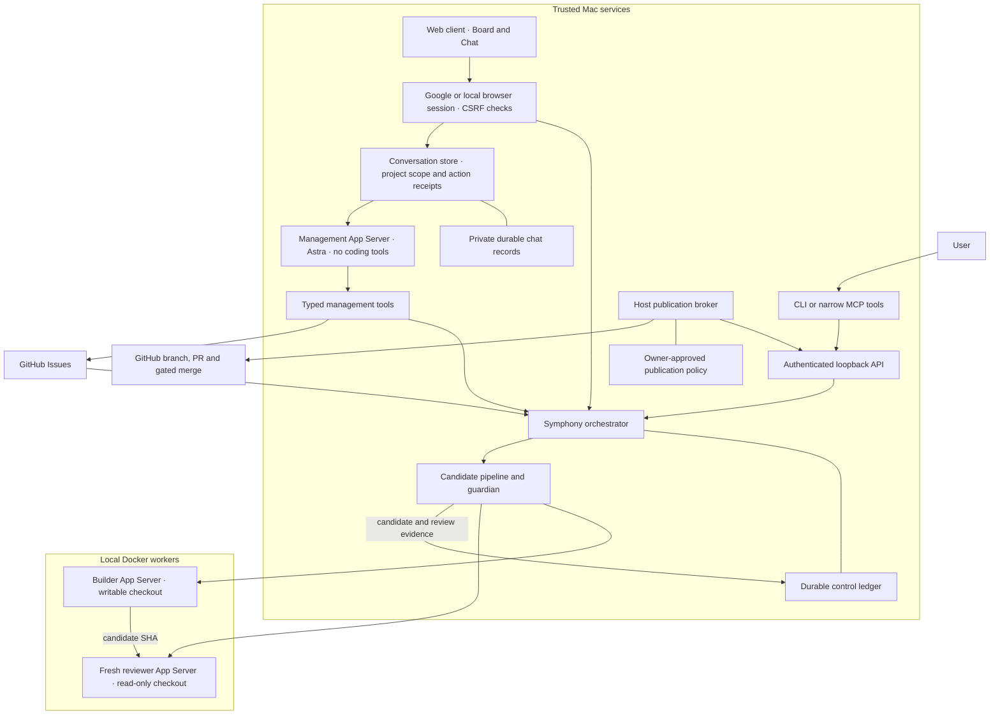

# Architecture

Symphony schedules coding work from GitHub Issues on one trusted Mac. The controlled
profile adds durable execution limits, operator commands, a separate reviewer and a
host publication broker. Coding workers run in local Docker containers; application
services and cloud infrastructure remain separate from this orchestration runtime.
New installations start paused with worker launch disabled. The operator enables
coding after validating the scoped container policies and a bounded delivery pilot.

The [GKE package](deploy/gke/README.md) owns Symphony's private image repository,
scoped image-pull grant, Terraform state and retained journal. The shared platform
repository owns node pools, networking and storage classes. The project board and
management chat are the single user interface. Every cloud application release must
include that full Phoenix implementation, its supervised chat runtime and durable
chat state, as defined by the [package contract](deploy/gke/README.md#required-application-package).
The [Linux application image](deploy/gke/application.Dockerfile) builds the combined
board, chat and Settings; its offline [integration probe](tools/probe_gke_application.py)
exercises the normal application and retained conversations across restart.
Local ports and the read-only preview launcher do not identify the deployed product.
Kubernetes execution and durable subscription authentication must pass
runtime verification before replacing the Mac task owner. The standalone
[runner](tools/kubernetes_runner.py) and [auth-slot journal](tools/kubernetes_auth.py)
are not wired into the live candidate pipeline. The patched cloud worker image passes
the real GKE gVisor permission and lifetime canaries. The standalone subscription
pilot has verified enrollment, provider-backed authentication and a real model task
across worker Pod replacement without another login. Cloud admission remains disabled. The [bounded pilot](deploy/gke/README.md#worker-sandbox-and-subscription-pilot)
owns those acceptance steps.

## System boundary

The scheduler owns admission and execution. The builder commits locally and the
reviewer examines that exact SHA in a separate checkout. The host broker validates
the retained handoff before publishing a branch and draft PR. An explicitly enabled
documentation-only merge policy adds independent path, review, branch-protection and
CI gates. Deployment still requires the user's authorization. MCP forwards bounded
commands to the native API and owns no scheduling state.

## Code map

- [`profiles/events-concierge/profile.py`](profiles/events-concierge/profile.py)
  owns project configuration and the local launch environment. Project workflow
  policy is versioned alongside the profile; credentials and runtime files are
  not source documentation.
- [`Tracker`](elixir/lib/symphony_elixir/tracker.ex) selects the provider adapter.
  [`GitHub.Admission`](elixir/lib/symphony_elixir/github/admission.ex) requires an
  explicit dependency declaration and verifies referenced issues directly.
- [`Orchestrator`](elixir/lib/symphony_elixir/orchestrator.ex) is the single
  scheduling authority. It polls, reconciles eligibility, reserves attempts,
  starts supervised workers and handles completion, deadlines and retries.
- [`ControlLedger`](elixir/lib/symphony_elixir/control_ledger.ex) retains operating
  mode, the concurrency override, issue holds, attempts, runtime/token totals and candidate handoffs.
  The orchestrator owns writes; an OS advisory lock rejects a second owner.
- [`AgentRunner`](elixir/lib/symphony_elixir/agent_runner.ex) selects controlled or
  upstream execution. [`CandidatePipeline`](elixir/lib/symphony_elixir/candidate_pipeline.ex)
  performs the bounded builder/reviewer sequence and validates its results.
- [`Codex.AppServer`](elixir/lib/symphony_elixir/codex/app_server.ex) implements
  the Codex stdio protocol and verifies the named permission profile before each
  controlled thread can run. [`ProcessGroup`](elixir/lib/symphony_elixir/process_group.ex)
  owns the host guardian and workspace lock.
  [`container_worker.py`](tools/container_worker.py) creates and attaches the
  guardian-owned container using an immutable local image ID.
- [`Workspace`](elixir/lib/symphony_elixir/workspace.ex) creates and validates
  execution directories. Controlled mode retains workspaces for recovery.
- [`TaskBoard`](elixir/lib/symphony_elixir_web/task_board.ex) combines tracker issues,
  runtime and durable holds for the LiveView Kanban board. Sorting and manual order
  are browser preferences. Card and Settings dialogs preserve the board underneath.
  [`BrowserAuth`](elixir/lib/symphony_elixir_web/browser_auth.ex) checks Google or
  local operator sessions. Google mode protects the board, chat and read APIs before
  project data is returned; an explicit allowlist controls operator access.
  `BoardActions` forwards only existing commands with native project,
  revision and idempotency checks. The same checks apply to chat control actions.
  Concurrency changes persist in the ledger and affect admission only: they never
  interrupt existing work or reset budgets. The workflow's configured concurrency
  remains the ceiling and default, including after reload or restart; restoring the
  default clears only the override. The control snapshot owns the reported effective
  value and read-only budget settings, including in the read-only preview.
- [`ReadOnlyBoard`](elixir/lib/symphony_elixir_web/read_only_board.ex) supports a
  separate local UI against a configured controller. The
  [`web launcher`](tools/symphony_web.py) starts only the web dependencies and reads
  live GitHub and controller status; it owns no scheduler or execution state.
  GitHub PR relationships, review decisions and current-head checks enrich cards
  without changing task admission, lifecycle stages or deployment claims.
- [`Chat.Store`](elixir/lib/symphony_elixir/chat/store.ex) owns project-bound conversations,
  streamed display state, action decisions and durable recovery through `Chat.Persistence`.
  [`Chat.Runtime`](elixir/lib/symphony_elixir/chat/runtime.ex) runs private App Server
  turns in a dedicated Codex home, retaining native thread history and compaction.
  [`Chat.Tools`](elixir/lib/symphony_elixir/chat/tools.ex) exposes typed project reads and
  bounded action proposals. `Chat.GitHub` owns the scoped tracker HTTP operations.
  [`ChatPanel`](elixir/lib/symphony_elixir_web/live/chat_panel.ex) renders messages, validated
  widgets, references and action previews through the existing LiveView connection.
- [`ControlApiController`](elixir/lib/symphony_elixir_web/controllers/control_api_controller.ex)
  authenticates local control requests. [`symphony_control.py`](tools/symphony_control.py)
  provides CLI and stdio MCP clients of that API.
- [`symphony_publish.py`](tools/symphony_publish.py) validates candidate identity,
  publishes PRs and enforces the approved automatic-merge policy using host credentials.
  [`symphony_service.py`](tools/symphony_service.py) manages the scheduler and publication
  broker as separate macOS launch agents; it adds no task scheduler.

## Execution and ownership

GitHub owns task intent and issue/PR state. The control ledger owns execution
controls, not a second backlog. Notion owns explanations and plans; reports should
link current GitHub records and runtime observations rather than copy task status.

Each controlled attempt reserves its budget before launch and receives a random
run identifier. Worker events must match both the running record and the durable
active reservation. A candidate handoff settles that reservation and installs an
`owner_review` hold, preventing normal continuation from rebuilding it. The trusted
baseline comes from operator configuration, not the builder's handoff file.

A fresh reviewer thread has a separate checkout mounted read-only. Builder and
reviewer token usage count toward the same issue ceiling. Host hooks and candidate
verification remain trusted operations outside the coding containers.
Copying the independent review repository allows 120 seconds; other candidate Git
commands allow 30 seconds. The remaining issue deadline still bounds the pipeline.
Before host Git commands or hooks execute, a guard inside the workspace lock rejects
Git metadata indirection and executable configuration, including file filters. Managed
task checkouts must be standalone clones with ordinary Git metadata; submodules and
nested repositories are unsupported.

The guardian holds a host-owned workspace lock during execution and cleanup. A
private intent records container ownership before creation; the container must be
identified before it starts. Cleanup targets that exact owner and local Docker
endpoint. Ambiguous creation, unavailable Docker or unverified removal retains a
marker that blocks reuse of the workspace. A stopped Erlang task alone does not
prove that its container has stopped.

## Failure and control rules

- Pause stops active work and prevents dispatch. Drain prevents new worker
  lifetimes while allowing the current bounded pipeline to finish. Resume allows
  eligible work again. Cancel holds one issue; retry clears its hold without
  resetting budgets.
- Commands carry an idempotency key and expected operator revision. A successful
  response follows an atomic, synced ledger write. Failed persistence blocks
  admission and stops owned workers.
- Issue runtime has an independent OTP deadline, so a slow tracker poll cannot
  leave the coding worker running indefinitely. Token limits apply when usage
  events arrive and can overshoot by the last reporting increment.
- Restart holds interrupted attempts and starts paused when recovery is needed.
  Live elapsed time uses a monotonic clock. After an unknown runtime epoch, the
  outstanding runtime reservation is charged conservatively; restart does not
  grant a fresh budget.
- Control configuration is fixed for the process lifetime. Changing it requires
  restart; the running instance fails closed rather than switching ledgers or
  silently dropping controls.

## Browser identity

`browser_auth.provider` selects Google OpenID Connect or the backward-compatible
`local_token` login. Google sign-in uses a server-side authorization-code exchange
with PKCE, state and nonce checks, and validates signed Google identity claims.
Only the configured public origin can establish a browser session. Google tokens
stay out of the browser session; the login grants no Drive, Gmail or other service-data access.

Authorization requires an exact allowlisted, verified email controlled by Google.
Gmail identities can be additionally pinned through `allowed_subjects`; Workspace
identities must be pinned to a Google subject as well as their email. An arbitrary
third-party email attached to a Google account is not accepted. The session retains
the Google issuer and stable subject; all allowed operators share the configured
project's operator authority, with no per-user roles or separate chat histories.

The bounded session owner keeps browser grants in memory; restarting the application
signs browsers out while retaining durable conversations. Sign-out revokes the grant
and disconnects its live sockets. Identity configuration changes invalidate affected
grants. Provider and public-origin changes require a restart to refresh the socket
origin policy. Existing control tokens remain for
local API/CLI clients and are not an alternate browser login in Google mode.
See [configuration and recovery](elixir/README.md#browser-sign-in).

## Management conversations

Each chat has an immutable project identity and retained tracker fingerprint. The
project picker filters chats; it cannot move a conversation into another project.
The current service exposes one configured tracker project. Multi-controller routing
is a separate extension. Historical messages are records; tools refresh current work
and attach source timestamps, task links and board filters.

The board hosts the shared conversation component in a right-side panel; `/chat`
is its standalone host. Task popups remain interactive alongside the panel.
[`Chat.ViewContext`](elixir/lib/symphony_elixir/chat/view_context.ex) validates a
bounded snapshot for each user message: project, filters, selected task ID,
up to 50 displayed task IDs, their viewport subset, hidden columns and timestamps.
The browser sends IDs and display metadata, never arbitrary page text, screenshots
or form contents. The parent restricts IDs to its current board; the store validates
the immutable project boundary again before persistence and model execution.

The board snapshot accompanies each message automatically and is retained with that
message. A standalone conversation without a matching board view has no current snapshot;
it must not reuse an older view. The Context tab separates the next message's snapshot
from retained history; Outputs and Sources expose recorded tool artifacts and references.
Changing tabs does not reset the composer or conversation. Tabs are presentation state;
conversation records remain owned by the store. `symphony_view_context` refreshes
authorized task summaries and reports missing records, stale sources and truncation.
Snapshot hints never grant write authority. `symphony_task_details` retains each
linked PR’s independent state, review, head revision and CI; a merged PR does not
imply issue completion.

There are three distinct records: the app's visible messages and receipts, Codex's
native thread history with automatic compaction, and committed project documents
retrieved on demand. Compaction does not erase the visible conversation or create a
shared project memory. Documents and task text are untrusted data. The Sources tab shows
retrieved references, not a claim to list every token in the model context.

Only browser decisions execute write proposals. Native controls retain revision and
idempotency checks inside the orchestrator. Tracker edits require a cancelled, idle
task and serialize with local dispatch; fresh GitHub timestamps reject observed
staleness. GitHub does not provide an atomic compare-and-swap across the final read
and patch, so concurrent external issue edits remain a limitation. Feedback is an
additive issue comment, not a message delivered into a running coding turn.

Before a write, the app persists its executing state. An uncertain result requires
read-only reconciliation using the exact native receipt or GitHub marker; it never
automatically repeats the write. Browser disconnects leave work running. Service
restart interrupts chat turns and marks in-flight writes uncertain. A single store
owner, bounded concurrency and private atomic files retain the Mac's history. This
storage design requires persistent local storage and is not a multi-replica database.

Direct dynamic tools keep project authority, UI widgets and existing controls in one
backend. MCP remains an optional client interface for external management agents;
the web chat does not call MCP to reach its own service. Codex 0.154.0 is pinned for
this experimental protocol. The management runtime registers no execution environments
or coding tools and disables inherited Apps, plugins, MCP servers and instructions.
This reduces the model's tool authority; it is not a container isolation boundary.
Google browser identity is separate from the model's subscription login and GitHub
service credentials. Remote ingress, retained storage and cloud runtime credentials
still require the [GKE deployment contract](deploy/gke/README.md); configuring Google
sign-in does not deploy or enable a cloud controller.

The integration follows the [App Server thread and turn lifecycle](https://learn.chatgpt.com/docs/app-server)
and [typed function-calling guidance](https://developers.openai.com/api/docs/guides/function-calling):
keep tools narrow and inject trusted project identity in the host instead of asking
the model to choose its authorization scope.

## Trust and extension points

The host scheduler, publication broker, hooks and Docker daemon are trusted. Coding
containers receive their task checkout and dedicated Codex state, without host GitHub,
cloud or control credentials, a Docker socket, or the personal home directory. The
container root filesystem is read-only, capabilities are dropped, resources are
bounded, and the reviewer checkout is mounted read-only. Codex permission policies
must separately protect the mounted authentication and session state from coding
tools; container mounts alone do not provide that separation. Controlled threads select
`symphony-builder` or `symphony-reviewer` and require that exact profile in the startup
response. Builder tools may write the checkout; reviewer tools are read-only. Both
profiles deny command network access and reads of outside files and `.env` files.
Legacy sandbox fields are omitted so subsequent turns retain the named policy.
The dedicated worker configuration disables account-connected Apps explicitly;
connector traffic is outside the command network sandbox. GitHub publication
credentials and connector authority stay with the host coordinator.

Live worker launch has a separate disabled-by-default host gate. Container cancellation,
credential isolation and a bounded real pilot must pass before activation. The native
Mac process-group path cannot contain real Codex commands that detach into other
groups; its fixture tests do not establish the container boundary. Implementation and
local unit coverage do not imply accepted live operation.

[`worker_policy.py`](tools/worker_policy.py) renders the AppArmor policy for the
configured private workspace root. Its finite mount rules permit Codex's inner Linux
sandbox without exposing other checkouts. Colima loads that named profile in enforce
mode; Docker's default policy remains unchanged for other containers. The host pins
the rendered AppArmor and repository seccomp digests. The actual worker entrypoint
checks both policies and the workspace scope before launching either role.

Linux canaries use the same policy selector and container wrapper as normal launches,
with disposable fake authentication under the configured workspace root. They verify
named builder/reviewer permissions, protected-file and network restrictions, and
cancellation of pipe, PTY and detached-child commands. The real issue-to-PR pilot also
exercises the full host entrypoint, dedicated sign-in, handoff and publication path.

The host publication broker can perform only the approved repository operations.
Automatic merge requires explicit host enablement, issue opt-in, a clean review of
the same SHA, an allowed small documentation diff, verified protected integration
branch and successful required checks from pinned GitHub Apps. Unknown evidence
blocks publication or merge. Cloud provisioning, application deployment, access
changes and purchases remain outside this service's authority.

Extend tracker adapters for new providers and profiles for new repositories.
Keep scheduling and operator state in the orchestrator. Add MCP tools only as
small clients of existing native operations. A future remote runner must preserve
ownership, cancellation, credential isolation and budget behavior before replacing
the local execution boundary.

The exact control contract is in [SPEC Appendix B](SPEC.md#appendix-b-controlled-local-execution).
